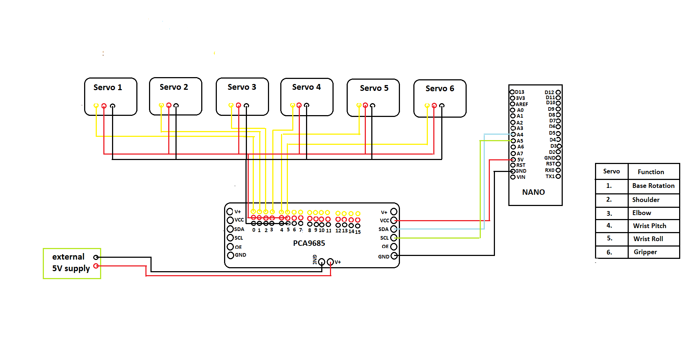
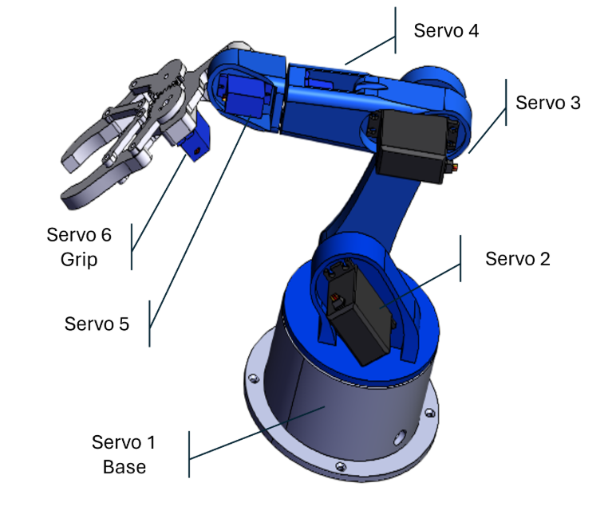
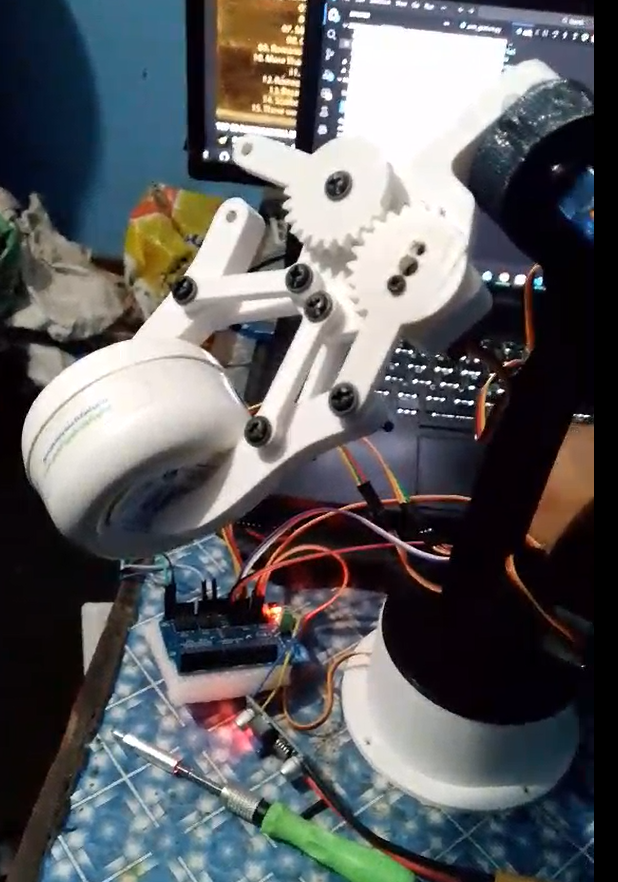

# ORION ROBOTIC ARM


*Figure: Orion Robotic Arm*

https://github.com/user-attachments/assets/ec81ec1a-1387-45c0-ae21-1b6e3b48f936

A voice-interactive robotic manipulation platform that combines speech recognition, conversational feedback, graphical manual control, and embedded motion control into a unified human-robot interaction system.

---

## 1. Design Philosophy

The objective of this project was not merely to build a 6-degree-of-freedom robotic arm capable of manipulating objects. Instead, the goal was to design a robotic platform that behaves more like an interactive robotic assistant than a conventional servo controller.

Rather than directly commanding individual joints, the user first establishes communication through a conversational interface. The software continuously monitors the communication link, provides spoken system feedback, interprets natural voice commands, and seamlessly transitions between autonomous voice control and manual operation without interrupting the robot's current state.

The architecture intentionally separates high-level human interaction from low-level motor control. Speech recognition, graphical interfaces, communication management, and servo actuation operate as independent software layers, making the platform easier to extend toward future autonomous robotics research.

---

## 2. System Architecture 

```text
                 Human Operator
                       │
              "Orion" Wake Word
                       │
          Speech Recognition Engine
                       │
               Command Interpreter
                       │
          Communication Verification
                       │
        ┌──────────────┴──────────────┐
        │                             │
   Voice Motion                 Manual Control
   Command Engine               (Tkinter GUI)
        │                             │
        └──────────────┬──────────────┘
                       │
             Joint State Manager
                       │
          Serial Communication Layer
                       │
                Arduino Nano
                       │
             PCA9685 Servo Driver
                       │
                 Six Servo Motors
                       │
                 6-DOF Robotic Arm
```
---

## 3. Project Scope & Contributions

This project focuses on the electronic integration and software architecture of a voice-interactive robotic manipulation platform. The mechanical arm itself is based on commercially available 6-DOF robotic arm kit. The engineering contributions of this project include:

- Integration of a six-servo actuation system using an Arduino Nano and PCA9685 PWM controller.
- Development of a Python-based voice interactive system featuring wake-word activation, communication diagnostics, and spoken feedback.
- Design of a dual-mode control architecture supporting both conversational voice commands and manual graphical control.
- Development of the serial communication protocol between the host computer and embedded controller.
- Implementation of thread-safe speech synthesis and synchronized state management between independent control modes.
- Electrical integration, power distribution, and hardware assembly of the complete robotic platform.

---

## 4. Human-Robot Interaction Workflow:

### Stage 1: Wake Sequence

The system remains idle until the wake phrase
  `Orion wake up`
is detected.

Once recognized, the assistant enters an active listening state and provides spoken confirmation that it is ready to receive commands.

### Stage 2: Communication Verification

Before executing any motion, the operator can verify the connection by asking
    `Can you communicate with the arm?`
The software checks whether the serial interface is successfully connected.

IF communication is available, Orion responds
    `Yes the connection to the arm is established and stable.`
Otherwise,
    `No, I cannot communicate with the arm.`
    `The error is (the following error which is breaking or preventing the communication)`
This prevents users from unknowingly issuing commands to disconnected hardware.

### Stage 3: Voice Motion Control

Once communication has been confirmed, high-level commands such as
    `turn right`
    `turn left`
    `move up`
    `move down`
are translated into coordinated servo angle updates.
The updated joint configuration is transmitted to the embedded controller through the serial interface.

### Stage 4: Manual Control

The user may issue 
    `Switch to manual mode`
Orion acknowledges the transition and automatically opens the graphical interface.

Each joint can now be controlled independently through dedicated sliders while preserving the current arm configuration.

---

## 5. Hardware Architecture 

### 5.1 Electronic Schematic



*Figure: Circuit Diagram*

| **Component** | **Purpose** |
| :--- | :--- |
| Arduino Nano | Embedded motion controller |
| PCA9685 Servo Driver | Generates hardware PWM for six servos |
| MG996R ×3 | Base, Shoulder, Elbow |
| MG99R ×3 | Wrist Pitch, Wrist Roll, Gripper |
| 12V Lipo Battery | External power source |
| Buck Converter | 12V -> 5V regulated supply |
| USB Serial | Communication between PC and Nano |

### 5.2 Actuator Topology & Kinematic Load Balancing

The arm utilizes a hybrid 6-DOF servo arrangement optimized for mechanical advantage and payload-to-torque distribution across the kinematic chain:

- **High-Torque Base & Arm Joints (Base, Shoulder, Elbow):** Driven by **3x MG996R High-Torque Metal-Gear Servos** to handle primary dynamic loads and structural leverage.

- **Precision Wrist & End-Effector Joints(Wrist Pitch, Wrist Roll, Gripper):** Driven by **3x MG99R Micro Metal-Gear Servos** to minimize distal weight while maintaining fine movement control.

### 5.3 Power Distribution & Regulation Circuit


*Figure: Power Supply*

To prevent logic brownouts and handle high-draw transient current spikes during simultaneous multi-axis servo sweeps: 

- **Primary Power Source:** 12V LiPo Battery.

- **Step-Down Regulation:** High-efficiency **DC-DC** Buck Converter dropping 12V down to a stable **5V output rail** dedicated exclusively to powering the 6 servo motors via the **PCA9685** high-current terminal blocks.

- **Logic Isolation:** The Arduino Nano operates on separate logic power (5V USB/VCC), sharing a common ground plane with the PCA9685 driver and Buck Converter to maintain clean I2C signal integrity.

### 5.4 Mechanical Configuration



*Figure: Reference mechanical configuration of the commercial 6-DOF robotic arm kit used in this project.*

The mechanical assembly was purchased as a kit, while the electronics, control software, communication architecture, and the system integration were developed as part of this project.

### 5.5 Pin & Channel Mapping

| **Servo Index** | **Physical Joint** | **Servo Model** | **Driver Output** | **Arduino I2C Mapping** |
| :--- | :--- | :--- | :--- | :--- |
| Servo 1 | Base Rotation | MG996R | Channel 0 | Pin A4 -> SDA |
| Servo 2 | Shoulder | MG996R | Channel 1 | Pin A5 -> SCL |
| Servo 3 | Elbow | MG996R | Channel 2 |--|
| Servo 4 | Wrist Pitch | MG99R | Channel 3 |--|
| Servo 5 | Wrist Roll | MG99R | Channel 4 |--|
| Servo 6 | Gripper | MG99R | Channel 5 |--|


## Why Arduino Nano Instead of ESP32?

The original architecture targeted the ESP32 because of its greater computational capability and wireless communication support. However, the project was developed under strict exhibition deadlines, and stable firmware development on the ESP32 proved significantly more challenging for a first embedded systems project.

To prioritize system reliability over architectural complexity, the controller was migrated to the Arduino Nano. This decision allowed the software stack, communication protocol, and servo control algorithms to be completed and thoroughly validated before demonstration,

## Why Manual Mode? 

The long-term objective was to implement inverse kinematics to allow Cartesian end-effector positioning. Although forward and inverse kinematics theory was studied, practical implementation required computation of the manipulator Jacobian for iterative inverse solutions.

Given the project's time constraints, a manual joint-space controller was selected instead. This approach provided precise joint-level manipulation while leaving the software architecture fully compatible with future inverse kinematics integration. 



*Figure: Robotic Arm*

---

## 6.Experimental Validation

This section documents the subsystem-level validation performed on the ORION robotic arm. Rather than evaluating the entire system simultaneously, each major hardware and software module was tested independently to verify functionality before full system integration.

### 6.1 Graphical User Interface (GUI) Validation


*Figure: Manual control interface developed using Tkinter.*

The manual control interface was evaluated to verify real-time communication between the host computer and the robotic arm.

### Test Procedure

- Established serial communication between the Python application and the Arduino Nano.
- Activated Manual Mode through the software interface.
- Individually manipulated each joint using the graphical sliders.
- Observed servo response and synchronization.

### Observations

- GUI launched successfully.
- Slider movements generated immediate serial commands.
- Servo positions updated without noticeable communication delay.
- Joint positions remained synchronized between software and hardware following the implementation of the state synchronization layer.

### Result

### PASS

The graphical control interface successfully provided reliable real-time manual manipulation of the robotic arm.

## 6.2 Base Rotation Validation

https://github.com/user-attachments/assets/682864d3-f2bd-451e-9623-8bdfbc9ef599

*Figure: Base rotation test.*

The base joint was tested to verify rotational control and communication latency.

### Test Procedure

- Commanded multiple clockwise and counter-clockwise rotations through the GUI.
- Verified angular response of Servo 1.

### Observations

- Base rotation responded accurately to operator input.
- No unexpected oscillations or communication failures were observed.
- Position updates remained consistent throughout repeated testing.

### Result 

### PASS

## 6.3  Shoulder Joint Load Assessment

In the above video of base rotation also provides a demonstration of shoulder joint. The shoulder actuator was evaluated while supporting the complete arm assembly.

### Test Procedure

- Raised the shoulder joint while remaining arm structure was fully assembled.
- Observed the arm's ability to maintain static equilibrium.

### Observations 

- The shoulder servo successfully initiated movement.
- As the manipulator reached full horizontal extension, the lever arm maximized the static torque demand at the shoulder pivot. The resulting moment exceeded the stall torque rating (11 kg.cm) of the MG996R servo, causing the link to yield under gravity while the firmware maintained active position commands.
- The failure occurred because the center of mass moved significantly away from the shoulder axis, increasing the required holding torque beyond the capability of the MG996R servo.

### Engineering Analysis

The limitation was mechanical rather than software-related. The controller continued issuing valid position commands throughout the test, indicating that communication and servo control remained functional.

### Proposed Improvements

- Counterweight or spring-assisted balancing mechanism.
- Reduced distal link mass.
- Increase the base area for the support of the arm.

### Result

### PARTIALLY SUCCESSFUL 

The control system operated correctly, while the mechanical design requires additional torque capacity for stable load-bearing operation.

## 6.4 Wrist Pitch and Roll Validation

https://github.com/user-attachments/assets/ec81ec1a-1387-45c0-ae21-1b6e3b48f936

*Figure: Wrist pitch and roll validation*

The wrist pitch and roll joint was evaluated independently to verify precise articulation.

### Test Procedure

- Incrementally adjusted wrist pitch and roll through the GUI.
- Observed smooth movement across the available angular range.

### Observations

- Motion remained smooth.
- Servo maintained commanded position.
- No abnormal vibration or communication errors occurred.

### Result

### PASS 

## 6.5 Gripper Validation


*Figure: Gripper Operation.*

Initial kinematic verification was conducted on a single-jaw configuration prior to final mechanical fastening of the opposing linkage.

### Test Procedure

- Executed multiple open/close cycles.
- Verified repeatability of motion.

### Observations

- Gripper responded consistently.
- Opening and closing actions remained repeatable.
- No communication failures occured during continuous operation.

### Result

### PASS

## 6.6 Voice Interaction Software Validation

The complete voice interaction pipeline was evaluated to verify communication between the user, the host software, and the robotic arm.

### Test Procedure

- Activated the system using the wake phrase "**Orion wake up.**"
- Verified serial communication using the command **"Can you communicate with the arm?"**
- Executed voice-based motion commands, including:
    - `Turn Left`
    -  `Turn Right`
    - `Move Up`
    - `Move Down`
- Verified transition from Voice Mode to Manual Mode using the command **"Switch to manual mode."**

### Observations

- The wake-word detection successfully activated the assistant.
- The communication verifcation correctly reported the connection status of the robotic arm.
- Motion commands were successfully interpreted and translated into corresponding servo movements.
- Spoken feedback was generated correctly for each interaction.
- The software successfully transitioned between Voice mode and Manual Mode without requiring a restart.
- Following implementation of the synchronization layer, mode switching no longer caused unintended servo repositioning.

### Documentation Note

The validation was performed successfully during system integration and exhibition preparation. However, no video recording of the voice-controlled demonstration was captured during testing.

### Result

### PASS

*Note: Due to time constraints during exhibition preparation, a video recording of the successful voice interaction test was not captured. The validation described above is based on the completed hardware testing performed during project integration.*

---

## 7. Engineering Challenges & Technical Solutions

### 7.1 Cross-Thread Text-to-Speech Race Conditions

### How the Problem Appeared

The robotic arm operates using two independent execution contexts: the Tkinter graphical user interface running on the main thread and the speech recognition engine executing on a background listener thread. During rapid transitions between voice commands and manual interactions, both threads could invoke the `pyttsx3` text-to-speech engine simultaneously.

Since `pyttsx3` is not inherently thread-safe, concurrent calls to `engine.say()` and `engine.runAndWait()` produced race conditions inside the underlying native audio engine. This resulted in intermittent application freezes, speech interruptions, and, in severe cases, complete Python crashes.

### Failure Analysis

The issue was traced to unsynchronized access to a shared software resource. While the speech recognition thread attempted to generate spoken feedback for a voice command, the GUI thread could simultaneously request another audio response during a mode transition. Because both threads accessed the same speech engine without mutual exclusion, the internal engine state became corrupted.

### The Solution

A dedicated mutex `tts_lock = Lock()` was introduced to serialize all interactions with the speech engine.
    ``` python 
    with tts_lock:
        engine.say(text)
        engine.runAndWait()
    ```

By protecting every speech generation request with a thread-safe lock, only one execution thread is permitted to access the text-to-speech engine at any given time. This eliminated race conditions entirely, allowing seamless transitions between voice execution and manual interaction regardless of user input frequency.

### 7.2 Joint State Discontinuity During Mode Switching

### How the Problem Appeared

Initially, switching between Voice Mode and Manual Mode caused every servo to immediately return to its default initialization angle (typically 90°). Since the physical robotic arm had already been repositioned through previous voice commands, activating the graphical interface introduced a sudden mismatch between the software's expected joint configuration and the robot's actual pose.

The resulting discontinuity caused abrupt, high-speed joint movements that produced unnecessary mechanical stress and significantly degraded the user experience.

### Failure Analysis

The graphical interface initialized each slider using predefined default values instead of the arm's current joint configuration. Consequently, the first interaction with any slider forced the software to overwrite the robot's existing pose with outdated initialization values.

The root cause was the absence of a shared state synchronization mechanism between the voice-control subsystem and the graphical control interface.

### The Solution

A dedicated state synchronization layer `sync_sliders()` was developed to maintain consistency between all control modes.

Whenever a voice command updates the global servo state dictionary, the GUI automatically refreshes every slider to reflect the latest joint positions before manual control becomes active. Instead of resetting the manipulator, the interface resumes control from the robot's current physical configuration. 

This software architecture ensures continuous state preservation across both interaction modes, eliminating kinematic discontinuities and providing smooth transitions between autonomous voice commands and manual joint manipulation.

---

## 8. Future Roadmap

The current version successfully validates the core architecture of ORION, including voice interaction, manual control, serial communication, and embedded servo actuation. Future development will focus on transforming ORION from a joint-space manipulator into a more intelligent and capable robotic platform. 

### ORION V2.0 -- Intelligent Motion Control

The next major release will focus on improving the robot's control capabilities and overall system performance.

### Planned Features

- **Advanced Actuation System:** Evaluate high-torque stepper motors, closed-loop servo motors with encoders, or linear actuators to improve positioning accuracy, repeatability, and payload capacity.

- **Forward & Inverse Kinematics:** Implement a complete kinematic model to enable Cartesian end-effector positioning instead of direct joint-angle control.

- **ESP32 Migration:** Replace the Arduino Nano with an ESP32 to support wireless communication and provide additional computational resources.

- **Motion Presets:** Add programmable motion sequences, allowing the arm to automatically perform predefined tasks such as pick-and place demonstrations.

### ORION V3.0 -- Intelligent Manipulation

Future research will extend ORION beyond manual operation by integrating computer vision and autonomous manipulation.

Potential developments include:

- OpenCV-based object detection and tracking.
- Vision-guided pick-and-place operations.
- AI-assisted manipulation and intelligent task execution. 
